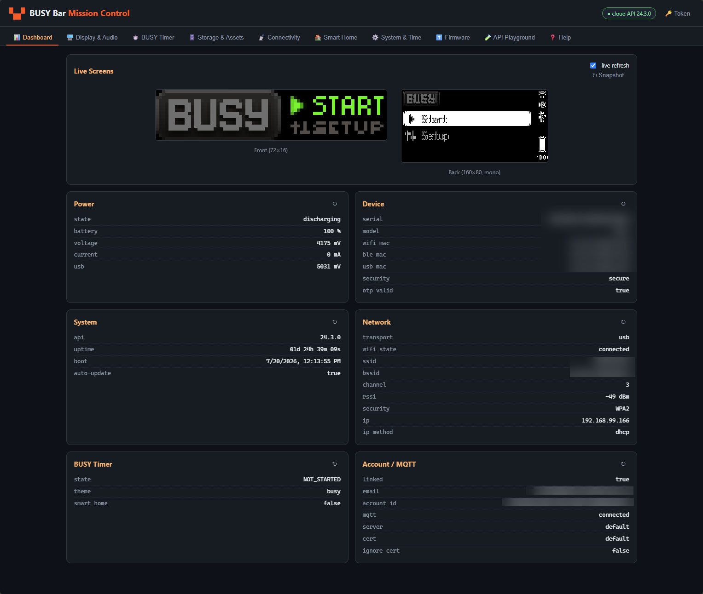

# BUSY Bar — Mission Control

A local web console for the **BUSY Bar** productivity device. It drives every
feature exposed by the BUSY Cloud BAR HTTP API
([docs](https://api.busy.app/busybar/docs), OpenAPI 1.1.0-rc) from a single
browser page — no cloud account UI required.

 



---

## Quick start

```bash
cd busybar-web
pip install flask requests
python app.py
# open http://127.0.0.1:8931
```

Requirements:

- Python 3.10+ (`flask`, `requests`)
- A BUSY Bar linked to your BUSY account, powered on, online via USB or Wi-Fi
- A **BAR-scope API token** (BUSY app → *Settings → Development → API tokens*).
  A token is pre-seeded in `app.py` (`DEFAULT_TOKEN`); change it at runtime via
  the **🔑 Token** button in the top bar — it is held only in the local proxy
  process and never sent to the browser.

## Architecture

```
Browser (static/index.html + app.js)
        │  fetch /api/…            (no CORS, no token in page)
        ▼
Flask proxy (app.py, 127.0.0.1:8931)
        │  Authorization: Bearer <token>
        ▼
https://api.busy.app/busybar  →  your BUSY Bar
```

Every UI action maps 1:1 onto a documented cloud endpoint. The proxy also adds
composite helpers (`/api/busy/start|pause|resume|stop`) that combine the
profile PUT + snapshot PUT the raw API requires, and decodes the screen
framebuffers (see below).

## Feature map (tabs)

| Tab | What you can do | Endpoints used |
|---|---|---|
| 📊 Dashboard | Live mirrors of both displays (2 s refresh), power/device/system/network/timer/account cards | `screen`, `status/*`, `wifi/status`, `transport`, `busy/snapshot`, `account/*` |
| 🖥️ Display & Audio | Draw text/images/animations/countdowns/rectangles (presets + raw JSON), clear display, play/stop audio, volume, brightness, remote key presses | `display/draw`, `audio/play`, `audio/volume`, `display/brightness`, `input` |
| ⏱️ BUSY Timer | Start Simple / Interval (Pomodoro) / Infinite sessions, pause/resume/stop, edit both timer profiles as JSON | `busy/snapshot`, `busy/profiles/{slot}` |
| 🗄️ Storage & Assets | Browse `/ext`, download/upload/mkdir/rename/delete, upload app assets, wipe an app's assets | `storage/*`, `assets/upload` |
| 📡 Connectivity | Wi-Fi status, transport, BLE enable/disable/unpair, local HTTP API access mode, MQTT backend config | `wifi/status`, `transport`, `ble/*`, `access`, `account/backend` |
| 🏠 Smart Home | Matter commissioning with rendered QR + manual code, fabric count/status, erase fabrics, emulated switch + startup behavior | `smart_home/pairing`, `smart_home/switch` |
| ⚙️ System & Time | Rename device, sync clock from browser, pick timezone (full tz list), firmware info, dump logs | `name`, `time*`, `status/firmware`, `log_dump` |
| ⬆️ Firmware | OTA check/install/abort with progress, changelog, auto-update window, manual `.tar` flash | `update*` |
| 🧪 API Playground | Call any of the 63 documented operations with custom params/body; status pill + timing | all |
| ❓ Help | In-app documentation (this content) | — |

## Screen framebuffer format (undocumented, reverse-engineered)

`GET /busybar/screen?display=N` is documented as `image/bmp` but actually
returns **base64-encoded raw framebuffers**:

| Display | Geometry | Encoding | Decoded bytes |
|---|---|---|---|
| Front (`display=0`) | 72 × 16, color | RGB888, 3 B/px, row-major | 3456 |
| Back (`display=1`) | 160 × 80, mono | 4-bit grayscale, 2 px/byte (high nibble = even x), 80 B/row | 6400 |

The proxy decodes the base64 and serves raw bytes with `X-Frame-Width`,
`X-Frame-Height`, `X-Frame-Format` (`rgb888` / `gray4`) headers; the frontend
expands them onto canvases.

## API coverage

All **63 operations / 48 paths** from the OpenAPI spec are proxied, including
the WebSocket status endpoint's HTTP handshake path. Auth is `Bearer` token
(`barApiToken` security scheme). See the **API reference** section in the Help
tab for the grouped list, or the spec at `https://api.busy.app/busybar/docs`.

## Troubleshooting

| Symptom | Fix |
|---|---|
| Red "unreachable" pill | Device offline or token invalid → power/connect the bar, set a fresh token via 🔑 Token |
| Draw ignored | Priority too low — a running work session holds priority 90; draw with ≥ 90 or stop the session |
| "no signal" canvases | Frame fetch failed → ↻ Snapshot; persistent = firmware changed the frame format |
| Storage 400 | Paths must match `^/ext(/[a-zA-Z0-9._-]*)*$` |
| Install blocked | Low battery — plug in USB power (`is_allowed` in update status) |
| Port in use | `PORT=9000 python app.py` |

## Security notes

- The token grants **full device control** (firmware flash, file erase, fabric
  erase). Keep it out of version control; rotate if leaked.
- The proxy binds to localhost only and has no auth of its own — don't expose
  the port.

## Files

```
busybar-web/
├── app.py                  # Flask proxy + composite helpers (~60 routes)
└── static/
    ├── index.html          # 10-tab UI
    ├── app.js              # all frontend logic
    ├── style.css           # dark theme
    └── vendor/qrcode.min.js  # QR for Matter pairing
```
